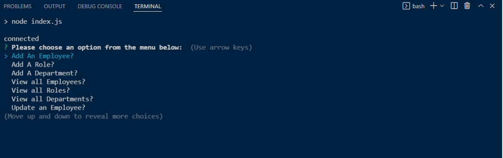
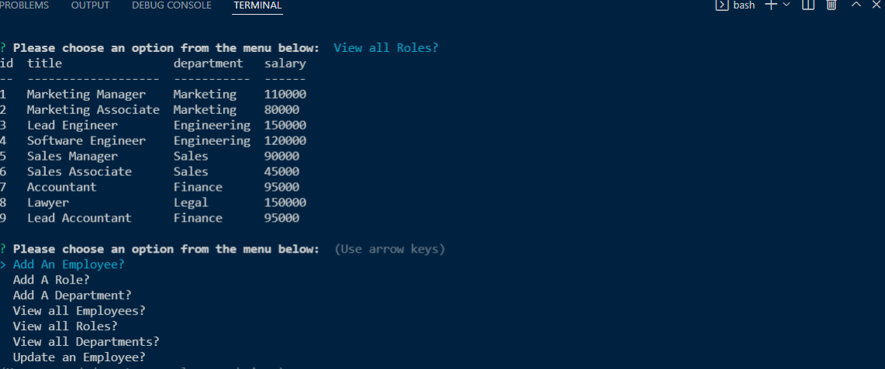

# Employee-Tracker

(Homework - 12: MySQL: Employee Tracker)

 

  
 

## Description:

Build a command-line application from scratch to manage a company's employee database, using Node.js, Inquirer, and MySQL.
 
 

## Table of contents:

  * [License](#license)
  * [Video](#video)
  * [Installation](#installation)
  * [Usage](#usage)
  * [Contributions](#contributions)
  * [Tests](#tests)
  * [Credits](#credits)
  * [Author](#author)
  * [Questions](#questions)

 
 
  
## License:
 
      -  MIT License - Copyright (c) 2022 Jason Yoo

 
 

## Video:

  
  
  
 

## Installation:
 
      -  Clone the files from my github repository provided below. You will also need to have installed MySQL to your computer and have installed console.table, inquirer, mysql2 and nodemon. 

 
 
  
## Usage: screenshots - (Highlighted Title(s) = a hyperlink to the direct image)

 

Once downloaded, open the file in VS Code.

 
  

[Screenshot1](images/Screenshot1.png)  "Initial Page On Load"

[Screenshot2](images/Screenshot2.png)  "Add an Employee option - completed with Leo Tolstoy as Lawyer"

 

[Screenshot3](images/Screenshot3.png)  "Add Role - For Finance Dept #3 with new role Lead Accountant"

 

[Screenshot4](images/Screenshot4.png)  "Add New Department - Human Resources"

 

[Screenshot5](images/Screenshot5.png)  "View all Employees"

 

[Screenshot6](images/Screenshot6.png)  "View all Roles"

 

[Screenshot7](images/Screenshot7.png)  "View all Departments"

 

[Screenshot8](images/Screenshot8.png)  "Update Employee - Leo Tolstoy changed to Marketing Manager"

 

 
 

  
## Contributions:
 
Reach me at my email provided below to be added as a contributor.

 
 
  
## Tests: 
 
Install MySQL to your computer, then npm install inquirer, mysql2, console.table and nodemon. Once they're installed, run npm install or node index.js into the terminal.
  
 
 

## Credits:
 
Much thanks to my brilliant tutor Mr. Faran Navazi for helping me work through several errors that occurred during the development of this application.

 
 

I would also like to thank my fellow cohort member Mr. Lewis Marcus for his help!

 
 

## Author:
 
Jason Yoo
  
 
 

## Questions:
  For any questions regarding this application, you may reach me directly at jasonjayoo@outlook.com.

  To view my other applications, please check out my github page [jasonjayoo](https://github.com/jasonjayoo).

